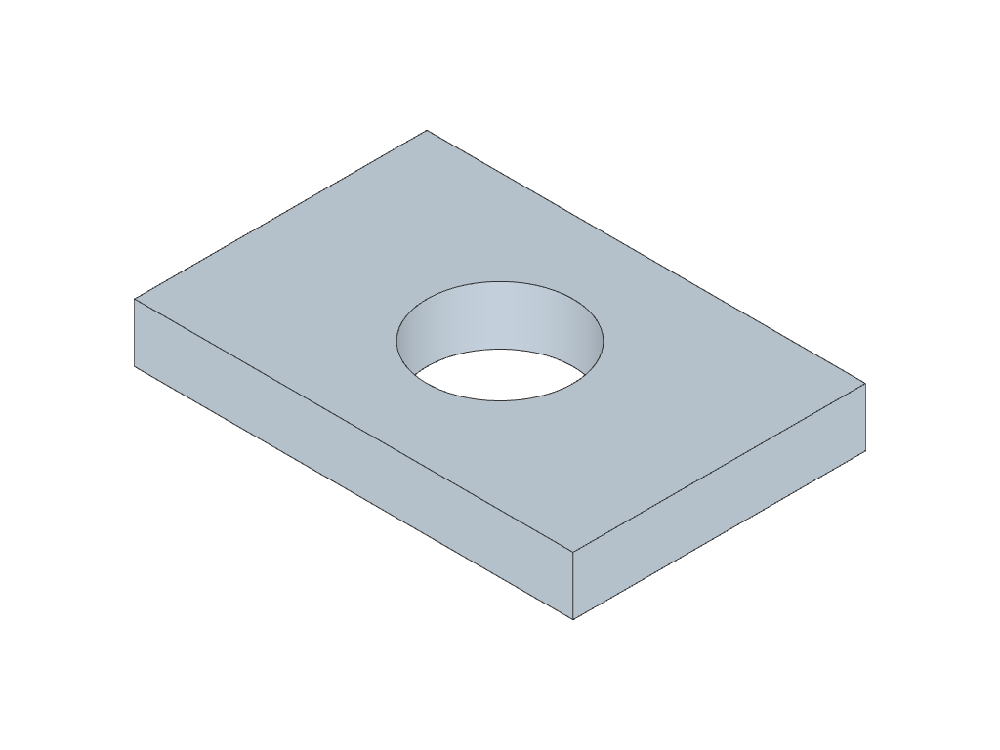

# Benchmark authoring requirements

What a benchmark labeller / data creator must deliver for one fixture
to be admitted to CADGenBench. Sister document to
[`submission.md`](submission.md), which covers what a *candidate* must
look like.

For the scoring math see [`docs/metrics.md`](../metrics.md) and the
per-metric deep dives under [`docs/metrics/`](../metrics/).

---

## File layout

Each fixture is split across two parallel directories:

- `data/inputs/<fixture>/`, public input shown to the agent.
- `data/gt/<fixture>/`, ground-truth artefacts (release TBD; the
  benchmark code does not assume this directory is shipped publicly).

```
data/inputs/<fixture>/
├── description.yaml                                  # REQUIRED, task spec
├── input.png                                         # REQUIRED for generation; OPTIONAL preview for editing
└── input.step                                        # REQUIRED for editing tasks (the starting STEP)

data/gt/<fixture>/
├── ground_truth.step                                 # REQUIRED, the GT solid
├── jig_<group_id>__<index>__<fit_type>.step          # OPTIONAL, interface sub-volume(s)
├── jig_<group_id>__<index>__<fit_type>.step
├── ...
├── ground_truth.pdf                                  # OPTIONAL, engineering drawing
├── SOURCE.md                                         # OPTIONAL, provenance / license
└── renders/                                          # OPTIONAL, auto GT preview renders
    ├── iso.png
    ├── front.png
    ├── top.png
    └── right.png
```

Anything outside the schema is ignored by the grader.

### `description.yaml`

Two task types are supported. The `task_type` field is the single
source of truth for which one a fixture is; the baseline agent and
the report tools branch on it.

**Generation** (current default):

```yaml
description: >
  Reproduce the part as accurately as possible from the input image.
  The finished part fits within an overall bounding box of approximately
  60 x 40 x 8 mm.

task_type: generation       # generation | editing
input_files:                # paths relative to data/inputs/<fixture>/
  - input.png

input_type: text+image      # advisory modality tag (kept for report tools)
category: cat3-interface-jig
```

**Editing**:

```yaml
description: >
  Edit the supplied part: double the diameter of the central
  through-hole while keeping all other dimensions unchanged.

task_type: editing
input_files:
  - input.step              # the starting STEP the agent must edit
  - input.png               # optional iso-render preview (recommended)

input_type: text+image+step
category: cat3-interface-jig
```

What the grader does with each field:

- `description`: prompt text shown to the agent.
- `task_type`: `generation` (default if absent) or `editing`.
- `input_files`:
  - `.png` / `.jpg` / `.gif` / `.webp`: inlined into the user message
    as an image content block.
  - `.step` / `.stp`: copied verbatim into the agent's working
    directory under the same filename. The agent is told the file
    exists and is expected to load it with `import_step(...)`,
    modify the geometry, and re-export the result as `output.step`.
- `input_type`, `category`: advisory metadata used by report tools.

The ground-truth side is identical for both task types: the grader
always compares the agent's `output.step` against
`data/gt/<fixture>/ground_truth.step`, regardless of how the
candidate was produced. An editing GT is just a regular GT that
happens to be a modified version of the input STEP.

### Worked example: editing

`jig-01-edit-double-hole` is a minimal editing fixture authored on
top of `jig-01-single-hole-plate`. The starting STEP is a 60 x 40 x
8 mm plate with a Ø10 mm central through-hole; the requested edit
doubles the hole to Ø20 mm and leaves everything else untouched.

| Input (`input.step`) | Ground truth (`ground_truth.step`) |
| :--: | :--: |
|  |  |

The full `description.yaml` for the fixture:

```yaml
description: >
  Edit the supplied part: double the diameter of the central through-hole
  from 10 mm to 20 mm. Keep all other dimensions of the plate identical
  (60 x 40 x 8 mm bounding box, hole centred at the origin, through the
  full plate thickness along Z).

task_type: editing
input_files:
  - input.step
  - input.png

input_type: text+image+step
category: cat3-interface-jig
```

At runtime the baseline agent receives the description text + the
preview PNG in its first message, and finds `input.step` already
present in its working directory. It is expected to load it with
`import_step("input.step")`, modify the geometry, and export the
result as `output.step`. The grader then scores `output.step` against
`data/gt/jig-01-edit-double-hole/ground_truth.step` using the same
four metric axes as a generation fixture.

---

## Canonical pose: REQUIRED for GT

The grading pipeline aligns each candidate to the GT before scoring;
that alignment is more robust when the GT is in a fixed canonical
pose, especially on rotationally- or mirror-symmetric parts. So we
**require** every `ground_truth.step` to be authored in canonical
pose. The `_to_move_to_dataset_repo/sanity_check_gt.py` script enforces
this; a GT that violates it fails the check.

1. **Bbox centroid at the origin**, bounding-box centre at $(0, 0, 0)$.
2. **Bbox extents ordered $L_x \ge L_y \ge L_z$**, longest axis along
   $X$, mid along $Y$, shortest along $Z$.
3. **Natural mounting / reference face down**, if the part has one,
   place it on the $z = -L_z/2$ plane with its outward normal along
   $-Z$. Parts without an obvious reference face: rules 1–2 suffice.

**Tolerances** (bbox-scale-relative, same family as the rest of the
pipeline):

- Centroid: $|\mathrm{centroid}| \le 0.001 \times \mathrm{bbox\_diag}$
  per axis.
- Axis ordering: $L_x \ge L_y \ge L_z$ within
  $0.001 \times \mathrm{bbox\_diag}$.

Rule 3 (mounting face down) is design intent, not numerically
verifiable; the sanity script does not enforce it but a reviewer will.

---

## Sub-volume conventions (interface match)

If the part has one or more **mating groups** (sets of features that
must align rigidly with another object, bolt patterns, bosses,
slots), the labeller delivers a sub-volume STEP file per feature.

### Filename schema

```
jig_<group_id>__<index>__<fit_type>.step
   │              │         │
   │              │         └── one of {KOR, KIR}
   │              └── 1-indexed integer within group_id
   └── 1-indexed integer (mating group)
```

- **`group_id`**, sub-volumes that must rigidly co-align belong to
  the same mating group (e.g. four bolt holes on one mounting
  face). The metric pose-searches each group as a single rigid unit.
- **`index`**, disambiguates sub-volumes within a group.
- **`fit_type`**, `KOR` (keep-out region: candidate's solid must be
  *absent* in this region, holes, slots, pockets) or `KIR` (keep-in
  region: candidate's solid must be *present* in this region, bosses,
  protrusions).

### Rigid-body pose

**Every sub-volume STEP is positioned at its absolute GT-specified pose
in the GT's coordinate frame.** This is the only "rigid-body
annotation" the labeller delivers, there is no separate pose JSON.
The pose lives inside the STEP itself, in the same frame as
`ground_truth.step`, so the grader can compare them directly without
any frame transformation.

See [`docs/metrics/interface_match.md`](../metrics/interface_match.md)
for the full metric specification (`bbox_R`, the verification shell,
the pose-search budget, etc.) and the *Labeller brief* section there
for examples.

---

## Sanity checks (automated)

Run before declaring a GT ready:

```bash
# NOTE: sanity-check scripts have moved to _to_move_to_dataset_repo/
# and will live in the cadgenbench-data HF dataset repo once it exists.
python _to_move_to_dataset_repo/sanity_check_gt.py --all       # all fixtures
python _to_move_to_dataset_repo/sanity_check_gt.py <fixture>   # one fixture
```

The script walks each fixture and asserts all of the following.
Failures are printed in a per-fixture table; the script exits non-zero
on any failure.

| # | Check | Rule from |
| --- | --- | --- |
| 1 | `analyze_step(ground_truth.step).is_valid` | [`metrics/cad_validity.md`](../metrics/cad_validity.md) |
| 2 | Canonical-pose centroid within tolerance | This doc § Canonical pose |
| 3 | Canonical-pose axis ordering within tolerance | This doc § Canonical pose |
| 4 | Mesh-derived $b_0$ equals BREP `solid_count` | [`metrics/topo_match.md`](../metrics/topo_match.md) § Sanity checks |
| 5 | Each sub-volume STEP loads + is valid | This doc § Sub-volume conventions |
| 6 | KOR consistency: $\mathrm{vol}(R \cap \mathrm{GT}) / \mathrm{vol}(R) \le \varepsilon$ | [`metrics/interface_match.md`](../metrics/interface_match.md) § Sanity checks #2 |
| 7 | KIR consistency: $\mathrm{vol}(R \cap \mathrm{GT}) / \mathrm{vol}(R) \ge 1 - \varepsilon$ | [`metrics/interface_match.md`](../metrics/interface_match.md) § Sanity checks #2 |
| 8 | Pairwise inflated `bbox_R` within each `group_id` may **not** overlap **when the two sub-volumes have opposite `fit_type`**. Same-`fit_type` overlap is allowed (see note below). | [`metrics/interface_match.md`](../metrics/interface_match.md) § Sanity checks #3 |
| 9 | **KIR** sub-volume AABB must lie inside `AABB(GT) + clip_offset`. **KOR** sub-volumes may extend past the GT AABB (see note below). | [`metrics/interface_match.md`](../metrics/interface_match.md) § Sanity checks #4 |
| 10 | End-to-end smoke: `interface_score(GT, GT)` ≈ 1.0 (saturated). Belt-and-braces against future refactors that break pipeline plumbing without breaking the per-sub-volume math. | [`metrics/interface_match.md`](../metrics/interface_match.md) § Sanity checks #1 |

Default tolerances:

- $\varepsilon = 0.01$ for KOR / KIR consistency (i.e. up to 1 % volume
  bleed allowed before failing, covers tessellation residue).
- `clip_offset = 0.05 × bbox_diag(GT)` (5 % of the GT bbox diagonal).

The mesh-based Boolean operations underpinning checks 6–9 use the
`manifold3d` kernel. See
[`src/cadgenbench/eval/booleans.py`](../../src/cadgenbench/eval/booleans.py).

### Why rules 8 and 9 are relaxed

Two real labelling patterns require non-strict versions of these rules:

- **Mounting-plane KORs.** A KOR slab placed below the bolt pattern
  (extending past `z_min` of the GT) enforces "the candidate must be
  empty here, so the part bolts cleanly onto a flat mating surface".
  That KOR intentionally extends past the GT AABB. Rule 9 allows this
  for KORs only; a KIR outside the GT would imply the candidate must
  extend past the GT footprint, which is almost always a labelling
  error.
- **Co-located same-`fit_type` sub-volumes.** A counter-bore can be
  two stacked KOR cylinders (wide cap + narrow through-hole) at the
  same XY. A flat mounting KOR may enclose smaller KOR bolt holes.
  Both patterns place compatible constraints on the same region (both
  say "empty here") and the per-sub-volume IoU is computed
  independently per sub-volume. Rule 8 allows it. Only KOR + KIR
  overlap (one says "empty", the other "filled" in the same region)
  is physically impossible and remains a hard fail.

---

## Cross-links

- Scoring math: [`docs/metrics.md`](../metrics.md)
- Interface metric details (sub-volumes, pose search, `bbox_R`):
  [`docs/metrics/interface_match.md`](../metrics/interface_match.md)
- Topology metric (Betti numbers, mesh-gate): [`docs/metrics/topo_match.md`](../metrics/topo_match.md)
- Candidate / submission requirements: [`submission.md`](submission.md)

## Code pointers

- Sanity checker: [`_to_move_to_dataset_repo/sanity_check_gt.py`](../../_to_move_to_dataset_repo/sanity_check_gt.py) (slated to move to the `cadgenbench-data` dataset repo)
- Mesh tessellation: [`src/cadgenbench/common/mesh.py`](../../src/cadgenbench/common/mesh.py)
- Mesh Booleans: [`src/cadgenbench/eval/booleans.py`](../../src/cadgenbench/eval/booleans.py)
- Sub-volume discovery + IoU: [`src/cadgenbench/eval/interface_match.py`](../../src/cadgenbench/eval/interface_match.py)
