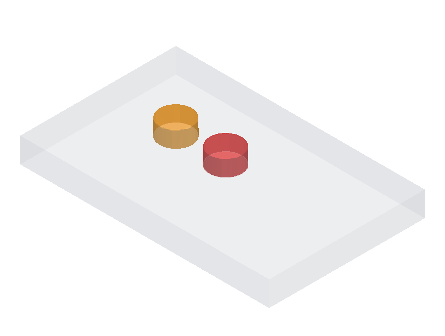
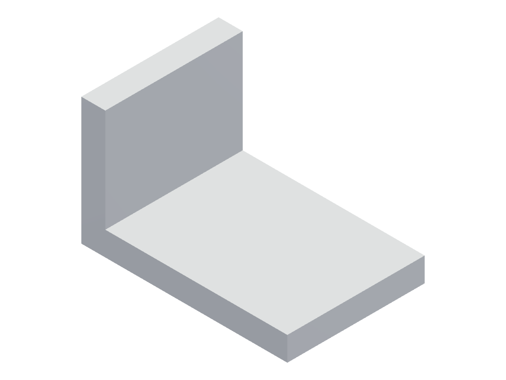
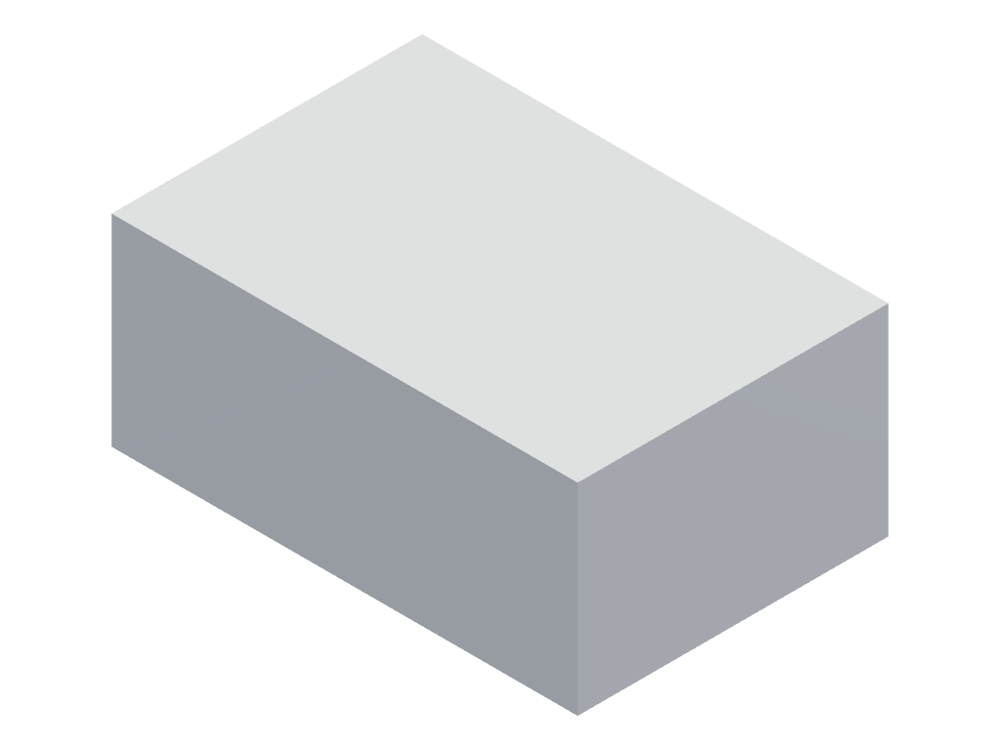
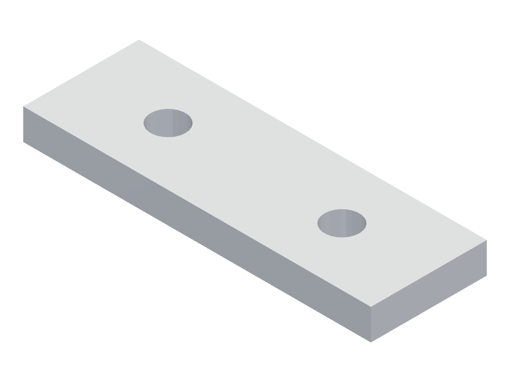
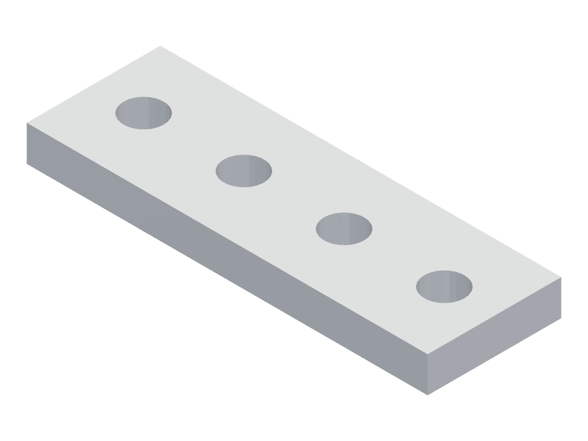
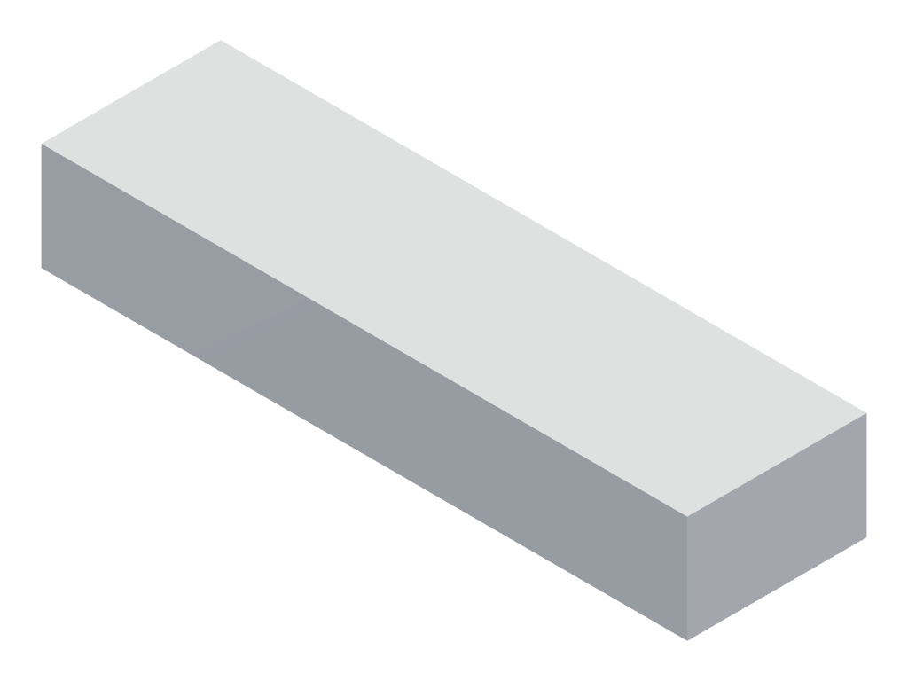
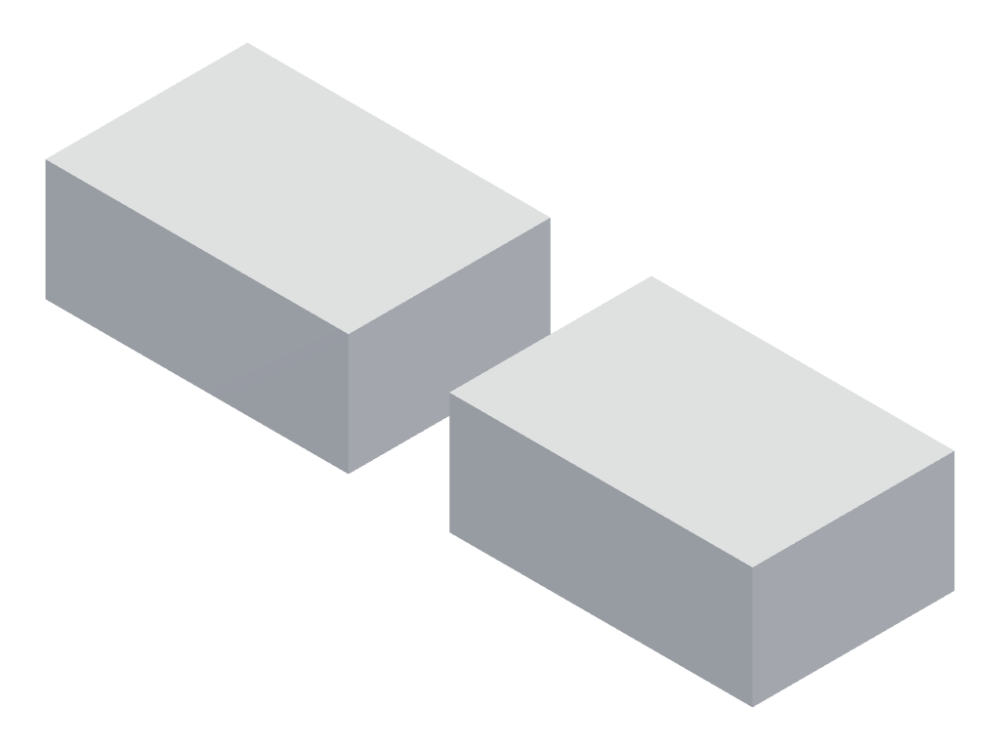
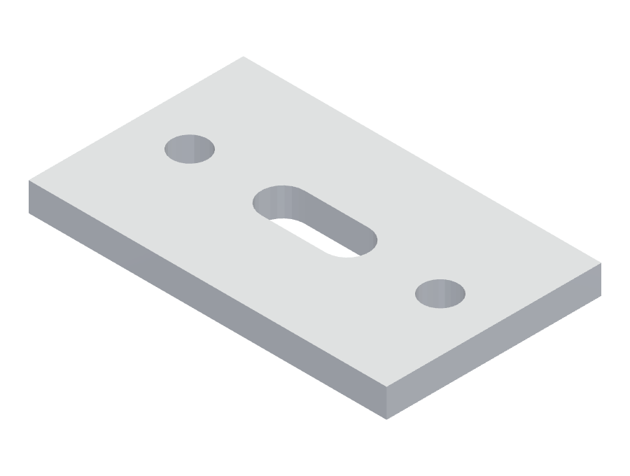
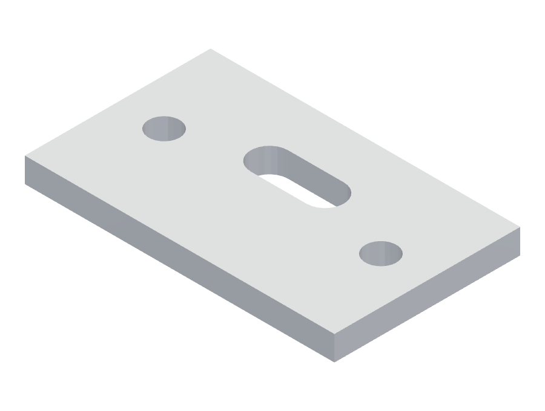
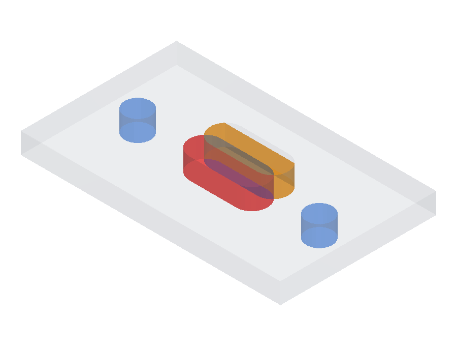

# CADGenBench: CAD Score metrics overview

How CADGenBench scores one generated CAD part (a STEP file)
against one ground-truth STEP file. This document
is the canonical reference. Each metric is summarised here and
detailed in its own deep-dive section below.

---

## TL;DR

For one candidate against one GT:

1. **Validity gate.** If the candidate STEP isn't a valid, watertight,
   meshable solid, `cad_score = 0`.
2. Otherwise, `cad_score` is a **weighted** mean of three independent
   $[0, 1]$ metrics:

```
            0                                                              if not is_valid
cad_score =
            0.4·shape_similarity + 0.4·interface + 0.2·topology_match      otherwise
```

(This is the **generation** composition. **Editing** tasks renormalize
the shape axis against the no-op input and reweight differently. See
[§ Editing tasks](#editing-tasks-no-op-renormalization) below.)

| Component | Range | What it asks | Deep dive |
| --- | --- | --- | --- |
| CAD Validity (gate) | $\{0, 1\}$ | Is the geometry valid? | [deep dive](./metrics/cad_validity.md) |
| Shape Similarity | $[0, 1]$ | Does the bulk geometry match? | [deep dive](./metrics/shape_similarity.md) |
| Topology Match | $[0, 1]$ | Same components / holes / voids? | [deep dive](./metrics/topo_match.md) |
| Interface Match | $[0, 1]$ | Does it bolt up to the same fixture? | [deep dive](./metrics/interface_match.md) |

---

## Coordinate convention & alignment

We instruct submissions to centre their models at $(0, 0, 0)$ and give
rules for orientation (longest axis, mounting frame), but in any case
rigidly align the outputs to the GT before scoring. Alignment is rotation
+ translation only, never scale. The production aligner generates identity,
PCA multi-start, and Open3D FGR candidates, refines them with Open3D
multi-scale point-to-plane ICP, then selects the final pose by
downstream-like shape agreement (bidirectional F1, capped symmetric
Chamfer, RMSE) rather than ICP residual. Trusted mesh sidecars are aligned
in memory and are not re-tessellated.

---

## Composition

```
                  ┌──────────────────┐
                  │  candidate STEP  │
                  └─────────┬────────┘
                            │
                            ▼
                  ┌──────────────────┐    fail   ┌─────────────────┐
                  │   CAD Validity   ├──────────►│  cad_score = 0  │
                  │   (hard gate)    │           └─────────────────┘
                  └─────────┬────────┘
                            │ pass
                            ▼
        ┌───────────────────┼───────────────────┐
        │                   │                   │
        ▼                   ▼                   ▼
┌────────────────┐  ┌────────────────┐  ┌────────────────┐
│ Shape          │  │ Topology       │  │ Interface      │
│ Similarity     │  │ Match          │  │ Match          │
│ (mean of 2     │  │ (Betti b₀b₁b₂  │  │ (per-group     │
│  sub-metrics)  │  │  agreement)    │  │  pose-searched │
│                │  │                │  │  IoU)          │
└────────┬───────┘  └────────┬───────┘  └────────┬───────┘
         │                   │                   │
         └───────────────────┼───────────────────┘
                             ▼
              weighted mean → cad_score ∈ [0, 1]
```

### Three orthogonal metrics

The three score components are orthogonal by construction. Each catches a class of error the others are blind to:

- **Shape Similarity** catches "wrong bulk geometry"; blind to topology (a torus and a thin loop pass the same IoU).
- **Topology Match** catches "wrong number of holes / pieces / voids"; blind to feature position (one hole left vs one hole right is identical).
- **Interface Match** catches "wrong feature position / size against spec"; blind to overall shape (the four bolt holes fit regardless of bracket appearance).

Validity is a gate, not a term.

---

## The four metrics at a glance

### 1. CAD Validity (gate)

A hard gate on the raw candidate STEP, checking that it is a well-formed BREP, watertight, and meshable as a closed orientable manifold. Any failure zeroes `cad_score`, so an invalid solid never beats a worse but valid one.

→ [Deep dive](./metrics/cad_validity.md).

### 2. Shape Similarity

Does the bulk geometry match? The mean of two complementary sub-metrics: a surface point-cloud agreement score (sensitive to where surfaces sit) and a volumetric IoU (sensitive to occupied volume).

→ [Deep dive](./metrics/shape_similarity.md).

### 3. Topology Match

Does the candidate have the same number of pieces, through-holes, and internal voids? It compares the three Betti numbers $(b_0, b_1, b_2)$ of candidate and GT, scoring each axis and combining them into one number. Blind to feature position and to topologically trivial features (blind pockets, fillets, chamfers), which the other axes cover.

→ [Deep dive](./metrics/topo_match.md).

### 4. Interface Match

Would it bolt up to the same fixture? Each mating feature is specified as a keep-out or keep-in sub-volume, and the candidate is scored on how well its material matches that region in shape, size, and position.

→ [Deep dive](./metrics/interface_match.md).

---

## Editing tasks: no-op renormalization

**Editing** fixtures (`task_type: editing`) ship an `input.step` plus an
edit request, and the GT is a small local change to that input. Since all
three axes measure global similarity, submitting the input unchanged (the
"no-op") already scores high, so scoring an edit with the raw composition
would reward doing nothing.

The fix renormalizes the **shape** axis against the no-op baseline
`b_shape = shape_similarity(input.step, GT)`:

```
s_renorm = max(0, (shape_similarity - b_shape) / (1 - b_shape))
```

This maps the no-op to `0` and a perfect candidate to `1`. Topology and
interface stay raw: most edits leave them unchanged, and a candidate that
breaks them should still be penalized.

Editing fixtures then use shape-dominant weights:

```
cad_score = 0.6·s_renorm + 0.3·interface + 0.1·topo_match     (0 if not valid)
```

A no-op therefore caps at `0.3 + 0.1 = 0.4`, and any real shape
improvement clears it.

`b_shape` is a fixture constant: it depends only on `input.step`,
`ground_truth.step`, and the shape/alignment code, so it is precomputed at
authoring time and committed to the GT dataset as
`<fixture>/edit_baseline.json`. The grader reads it back instead of
recomputing it, and the presence of that file is how the grader knows a
fixture is an editing task.

Implementation: [`edit_baseline.py`](../src/cadgenbench/eval/edit_baseline.py),
wired into `_cad_score` in [`evaluate.py`](../src/cadgenbench/eval/evaluate.py);
the raw and renormalized shape values are saved under
`result.json["edit_metrics"]`.

In the per-fixture report an editing candidate is shown as a ghost-diff
against the ground truth, which makes a small or internal change visible.
Red marks material the candidate added that the GT doesn't have (too
much); amber marks GT material the candidate is missing (too little). A
no-op shows up as the whole edit it skipped.



---

## Worked examples

Three minimal examples, one per axis. Each is built so that a single
metric is what separates the candidate from the ground truth while the
other two stay quiet, which is what it means for the three to be
orthogonal.

### Example 1: Shape Similarity catches wrong bulk geometry

Two single-piece parts with no holes and no mating features, so
topology and interface have nothing to disagree about and only the
bulk geometry is in play. The ground truth is an L-bracket; the
candidate is a plain block of roughly the same footprint. They enclose
different volumes and present different surfaces, so **shape
similarity** is the axis that notices the candidate simply isn't the
right shape.

| Ground truth | Candidate |
| :--: | :--: |
|  |  |

### Example 2: Topology Match catches a wrong feature count

Topology counts the pieces, through-handles, and internal voids. Two
cases, each changing one count while the bulk shape barely moves, so
shape similarity stays high and the eye is easily fooled.

A wrong number of through-holes: two bars of the same size and outline,
where the ground truth has two through-holes and the candidate has four.
The Betti numbers are `(1, 2, 0)` and `(1, 4, 0)`, so only the
through-handle count $b_1$ differs and scores `0.36`; the topology match
is the product `1.00 · 0.36 · 1.00 = 0.36`.

| Ground truth | Candidate |
| :--: | :--: |
|  |  |

A wrong number of pieces: the ground truth is one solid bar, the
candidate came out as two disconnected blocks. Now the component count
$b_0$ differs, `(1, 0, 0)` against `(2, 0, 0)`, and scores `0.444`; the
topology match is `0.444 · 1.00 · 1.00 = 0.444`.

| Ground truth | Candidate |
| :--: | :--: |
|  |  |

The three axis scores are multiplied, not averaged, so one wrong count
pulls the whole match down and a candidate cannot bank credit for the
two easy axes. Interface match aggregates differently: it takes the
worst feature inside a mating group and averages across independent
groups, shown next.

### Example 3: Interface Match catches a misplaced mating feature

A mounting plate with two bolt holes and a central slot. All three seat
on one fixture, so they form a single mating group. The candidate keeps
the outline, the hole count, and the slot, but the slot is shifted off
its specified position, so the plate would not seat. The bulk shape
barely moves and the feature counts do not change, so shape similarity
(`0.89`) and topology (`1.00`) stay high. Interface match is what catches
it: a group scores as its worst feature, so the offset slot drags the
whole interface score to `0.00`. The result is
`cad_score = 0.4 · 0.89 + 0.4 · 0.00 + 0.2 · 1.00 = 0.56`.

| Ground truth | Candidate |
| :--: | :--: |
|  |  |

In the overlay, the candidate is the grey ghost and each mating region is
**blue where it fits**, **red where the candidate has material it
shouldn't** (too much), and **amber where it's missing material it should
have** (too little). The two bolt holes are clear, so they read blue. The
slot is shifted off its position, so the required opening is blocked (red)
and the slot the candidate did cut sits where the plate should stay solid
(amber).


