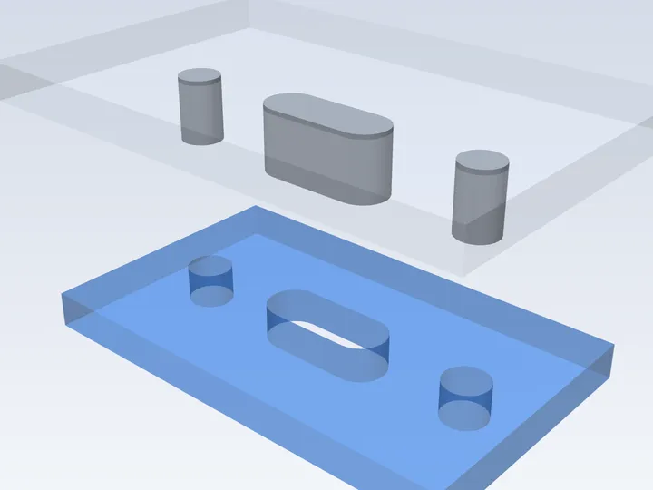
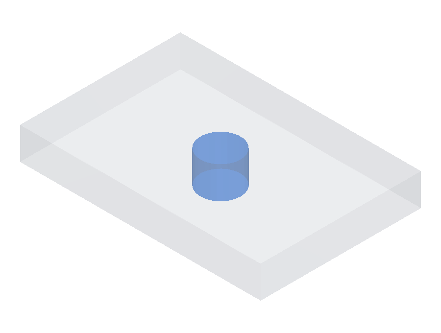
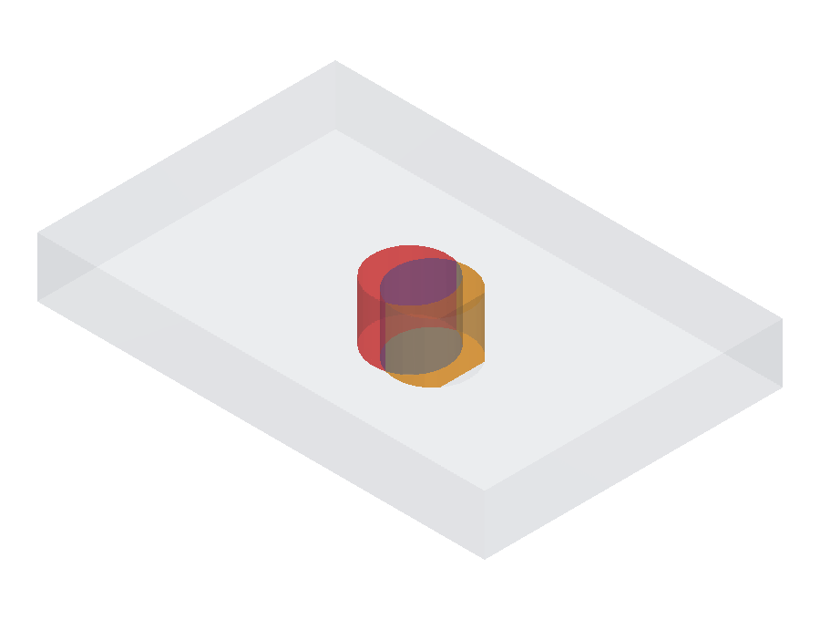
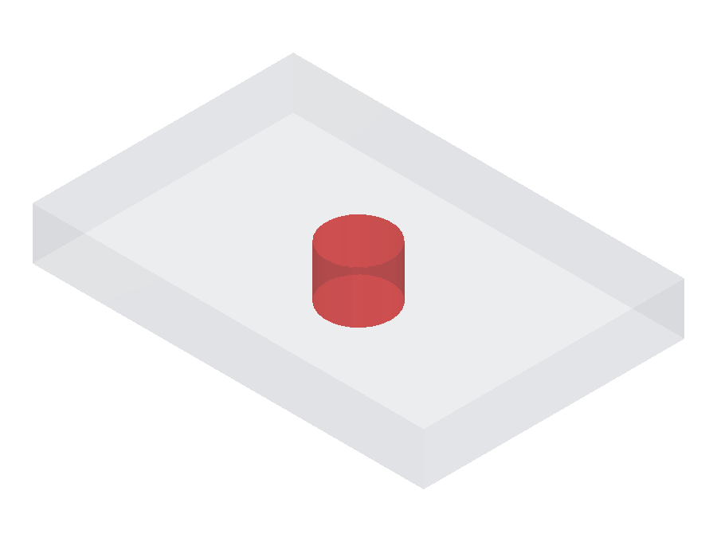
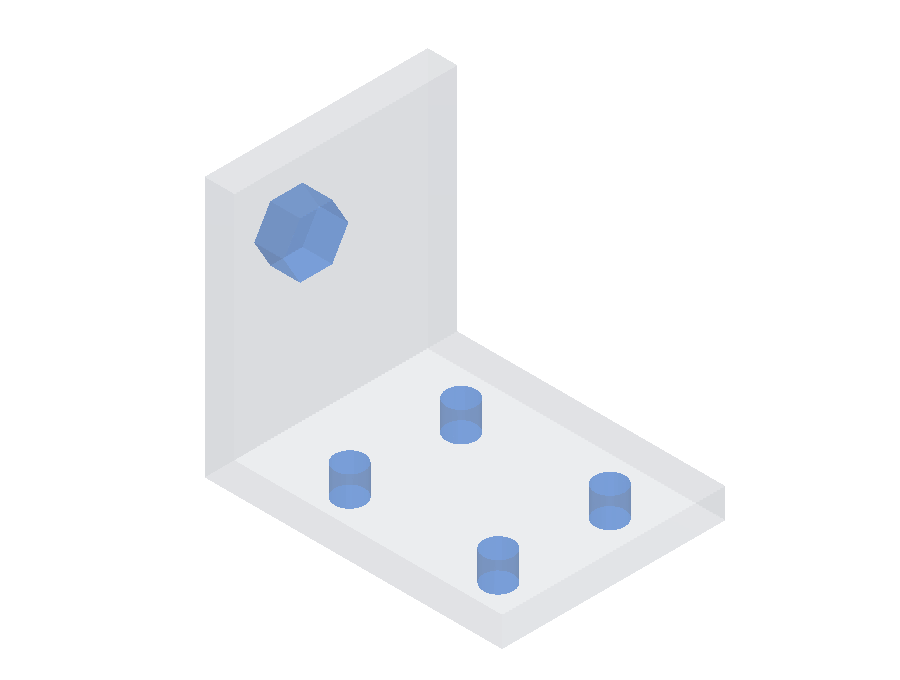
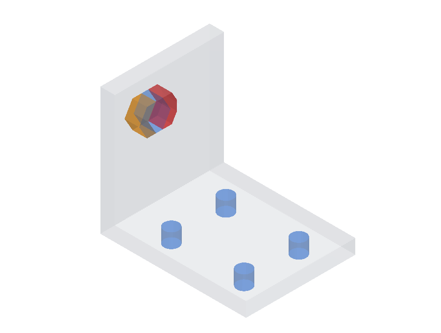
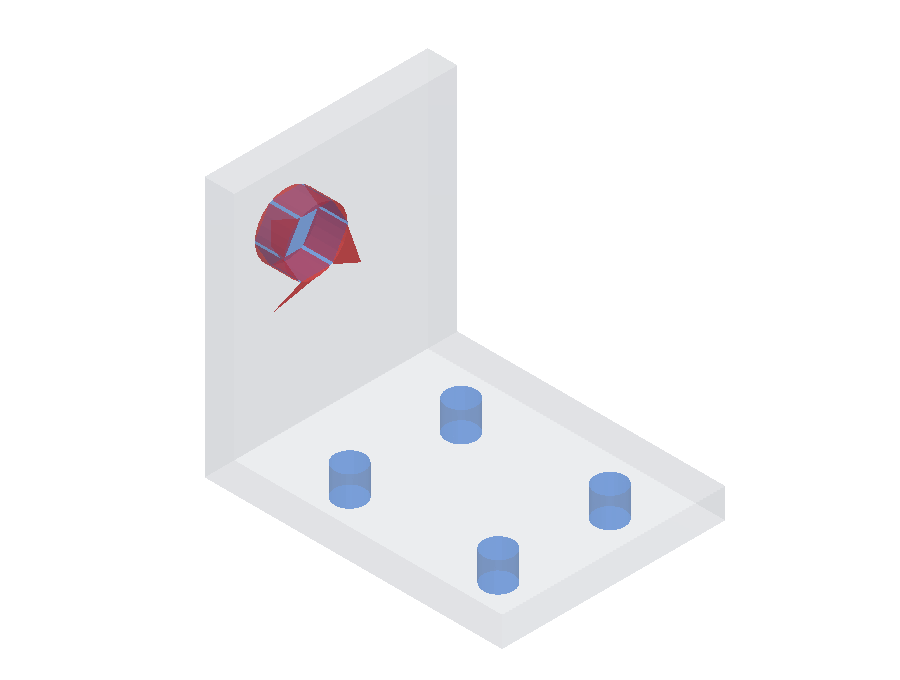

# Interface Match

Scores whether a candidate's mating features fit the same things the ground truth does: the holes, slots, bosses, and pockets that bolt, pin, or seat against another part. Each feature is checked volumetrically, so it has to match the spec in shape, size, and position.

The features that must seat together form one **mating group**: here, two bolt holes and a slot that a single jig drops into. A part can have several independent groups (for example a bolt pattern on one face and a boss on another), and each group is scored on its own.

## Keep-out and keep-in regions

Each mating feature is a region of space the candidate must match, of one of two kinds:

- **Keep-out region (KOR):** the candidate must be **empty** here. A bolt hole or a slot is a KOR; material in that space would block the bolt.
- **Keep-in region (KIR):** the candidate must be **solid** here. A locating boss or pin is a KIR; missing material leaves nothing to mate against.

## Scoring

For each group:

1. **Per-feature fit.** Each region is compared to the candidate by volumetric IoU. It is measured together with a thin shell of the opposite material around it, so both an oversize and an undersize feature lower the score, and a candidate cannot pass by leaving out the surrounding material.
2. **Bounded pose search.** The region is searched over a small window around its specified pose (±1° and ±1% of the part size per axis) and the best fit is kept, so a feature is not penalized for the small residual left by whole-part alignment.
3. **Pass/fail ramp.** Each IoU is mapped through a soft ramp (≥ 0.95 maps to 1, ≤ 0.80 maps to 0, linear between), so a sloppy fit scores 0 instead of banking partial credit.

A group scores as its **worst** feature (the minimum), and the fixture scores as the **mean** over its groups, so a part that nails one independent interface and misses another still earns partial credit.

## What a fit looks like

The per-fixture report overlays the candidate (grey ghost) against each region: **blue** where it fits, **red** where the candidate has material it shouldn't (too much), and **amber** where it's missing material it should have (too little). Both region kinds use the verification shell, so a wrong-*size* feature shows up too, not just one in the wrong place.

### Keep-out (KOR): a bolt-hole clearance

| Fits | Partial | Doesn't fit |
| :--: | :--: | :--: |
|  |  |  |

Left: the clearance is kept empty, all blue. Middle: the hole is slightly off, so part of the clearance is still kept (blue) while intruding material reads red and the over-cut plate reads amber. Right: the hole is missing, so material fills the whole clearance (red).

### Keep-in (KIR): a locating boss

| Fits | Partial | Doesn't fit |
| :--: | :--: | :--: |
|  |  |  |

Left: the boss fills the region, all blue (the four bolt-hole keep-outs around it are satisfied too). Middle: an offset boss is partly in the region (blue), partly leaves it empty (amber), and spills into the clearance (red). Right: the boss is missing, so the region reads amber.

Code: [`interface_match.py`](../../src/cadgenbench/eval/interface_match.py)
