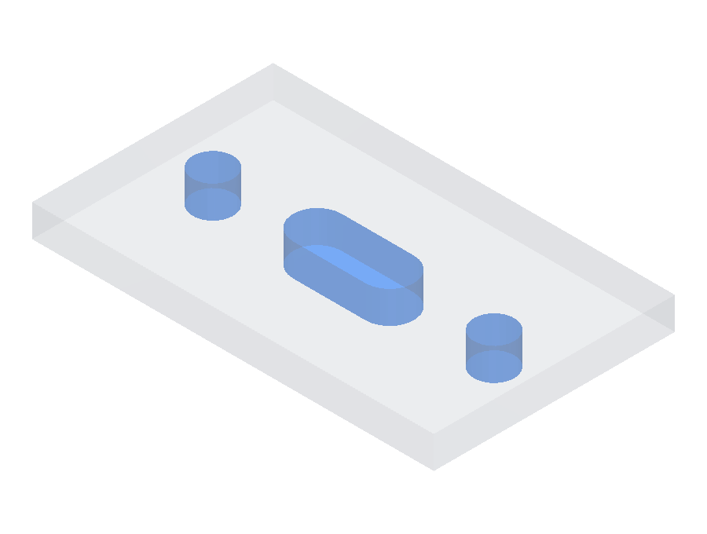

# Interface Match

Scores whether a candidate's mating features fit the same things the ground truth does: the holes, slots, bosses, and pockets that bolt, pin, or seat against another part. Each feature is checked volumetrically, so it has to match the spec in shape, size, and position.

## Keep-out and keep-in regions

Each mating feature is given as a region of space the candidate must match, of one of two kinds:

- **Keep-out region (KOR):** the candidate must be **empty** here. A bolt hole or a slot is a KOR; material in that space would block the bolt.
- **Keep-in region (KIR):** the candidate must be **solid** here. A locating boss or pin is a KIR; missing material leaves nothing to mate against.

## Mating groups

Features that must line up together form one **group**, for example the four holes of a single bolt pattern. A group is scored as a unit. Independent features, such as a bolt pattern on one face and a boss on another, are separate groups with no fixed relationship between them.

## Scoring

For each group:

1. **Per-feature fit.** Each region is compared to the candidate by volumetric IoU. It is measured together with a thin shell of the opposite material around it, so both an oversize and an undersize feature lower the score, and a candidate cannot pass by leaving out the surrounding material.
2. **Bounded pose search.** The region is searched over a small window around its specified pose (±1° and ±1% of the part size per axis) and the best fit is kept, so a feature is not penalized for the small residual left by whole-part alignment.
3. **Pass/fail ramp.** Each IoU is mapped through a soft ramp (≥ 0.95 maps to 1, ≤ 0.80 maps to 0, linear between), so a sloppy fit scores 0 instead of banking partial credit.

A group scores as its **worst** feature (the minimum), and the fixture scores as the **mean** over its groups, so a part that nails one independent interface and misses another still earns partial credit.

Code: [`interface_match.py`](../../src/cadgenbench/eval/interface_match.py)
