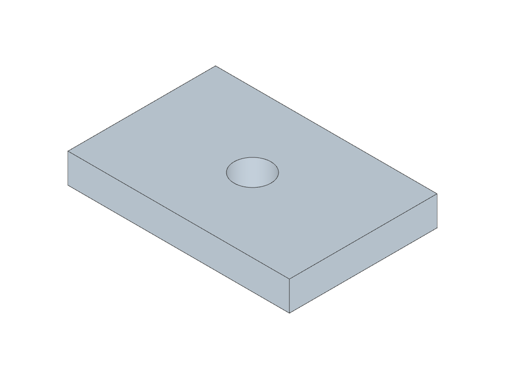

# Shape Similarity

Scores whether a candidate part's bulk geometry matches the ground truth, independently of topology and mating-interface specs. Three sub-metrics, each in $[0, 1]$, averaged into a single `shape_similarity_score`.

## What we check

| Sub-metric                | What it measures                                      | Best at catching                                       |
| ------------------------- | ----------------------------------------------------- | ------------------------------------------------------ |
| `shape_point_cloud_f1`    | Normal-weighted surface-point Chamfer F1              | Bulk shape drift, missing or extra bulk material       |
| `shape_volume_iou`        | Volumetric overlap of the solids                      | Wrong size / scale, gross volume mismatch              |
| `shape_feature_edge_f1`   | Chamfer F1 on dihedral-extracted feature-edge points  | Misplaced holes / bosses / slots, sharp-feature drift  |

$$
\text{shape\_similarity\_score} \;=\; \tfrac{1}{3}\bigl(\text{shape\_point\_cloud\_f1} + \text{shape\_volume\_iou} + \text{shape\_feature\_edge\_f1}\bigr)
$$

Three sub-metrics cancel each other's blind spots. Point-cloud F1 is dominated by big flat faces and a part with the right outline and the wrong holes scores high on it. Volume IoU is invariant to feature position. Feature-edge F1 picks up holes, slots, and creases but is silent on bulk surface area. The mean of the three is the simplest signal that all three signals agree.

F1 and IoU are preferred over a mean Chamfer distance because they are rate-based: each point either agrees within tolerance or doesn't, so a single outlier moves the score. A mean distance smooths outliers out and saturates.

## Pipeline

For one candidate against one GT:

1. **Rigid alignment.** ICP-align the candidate to the GT ([`alignment.py`](../../src/cadgenbench/eval/alignment.py)). Persists `aligned/output_aligned.step` and the RMSE; both are reused on re-runs.
2. **Tessellate.** Both shapes are meshed at a shared deflection derived from the GT bounding-box diagonal so candidate and GT live at one scale (gate-validated closed orientable manifold, see [`mesh.py`](../../src/cadgenbench/common/mesh.py)).
3. **Compute the three sub-metrics** (below).
4. **Average them** into `shape_similarity_score`.

---

### Sub-metric 1: `shape_point_cloud_f1`

Symmetric normal-weighted Chamfer F1 over surface point clouds.

50 000 points are area-weighted-sampled from each welded mesh; each sample carries the outward unit normal of its source triangle. A candidate point is a **hit** when both conditions hold:

1. Nearest-neighbour distance on the GT cloud is within $\tau_{\text{pc}} = \max(10^{-6},\ 0.01 \cdot \mathrm{diag}(\mathrm{bbox}_{\text{GT}}))$, i.e. 1 % of the GT bounding-box diagonal.
2. Outward unit normals satisfy $n_{\text{cand}} \cdot n_{\text{gt}} > 0.9$ (≈25° tolerance).

The same two-gate definition applies in the reverse direction. Then

$$
\text{precision} = \frac{\#\{p \in C : \text{hits GT}\}}{|C|}
\qquad
\text{recall} = \frac{\#\{q \in G : \text{hits candidate}\}}{|G|}
\qquad
F_1 = \frac{2 \cdot \text{precision} \cdot \text{recall}}{\text{precision} + \text{recall}}
$$

The normal gate rejects "right place, wrong side" matches: the back face of a thin wall, a flipped-orientation candidate, or two surfaces brushing past each other through a hole. It promotes the metric from "points are nearby" to "the same surface is nearby".

The 1 %-of-diagonal threshold scales naturally from a 10 mm rivet to a 1 m bracket; a fixed-mm tolerance does not.

### Sub-metric 2: `shape_volume_iou`

$$
\mathrm{IoU} = \frac{\mathrm{vol}(A \cap B)}{\mathrm{vol}(A \cup B)}
$$

Computed on the welded meshes via the [`manifold3d`](https://github.com/elalish/manifold) Boolean kernel. The union volume uses inclusion-exclusion: $|A \cup B| = |A| + |B| - |A \cap B|$.

Volume IoU is the one sub-metric a layperson can interpret without explanation ("what fraction of the GT solid is in the right place"). It's invariant to face decomposition, sampling seed, and view choice. On its own it's degenerate, two differently-shaped parts with similar bulk that happen to overlap can score near 1; the other two sub-metrics catch that.

### Sub-metric 3: `shape_feature_edge_f1`

Symmetric Chamfer F1 on mesh-derived feature-edge sample points.

For each side (candidate and GT):

1. Walk every undirected mesh edge incident to exactly two triangles. Compute its dihedral angle from the two outward face normals: $\text{angle} = \arccos\bigl(\mathrm{clip}(n_1 \cdot n_2,\,-1,\,1)\bigr)$.
2. **Keep** the edge if $\text{angle} \ge \tau_{\text{sharp}}$ (default 30°). **Drop** if $\text{angle} \le \tau_{\text{smooth}}$ (default 5°). **Exclude** edges in between from both candidate and GT (their dihedral signal is too uncertain to score, e.g. fillet tessellation noise).
3. Sample uniformly along each kept edge at spacing $s = 0.002 \cdot \mathrm{diag}(\mathrm{bbox}_{\text{GT}})$ (≈500 samples across a 100 mm part). Edges shorter than $s$ contribute their midpoint.

Then compute symmetric Chamfer F1 between the candidate and GT sample arrays with hit threshold $\tau = 0.01 \cdot \mathrm{diag}(\mathrm{bbox}_{\text{GT}})$ (the same 1 %-of-diagonal convention as `shape_point_cloud_f1`). If both arrays are empty (e.g. a sphere vs a sphere) the score is 1; if one is empty, the score is 0.

**Illustration.** Candidate vs GT under a small rigid misalignment (a few degrees rotation + a few mm offset on the longest axis), showing Symmetric Chamfer F1 behaviour on a real part. The image below is a **placeholder** (uses one of the stub jig fixtures' renders, not the actual scenario described); it will be regenerated against the real benchmark dataset, see `space-setup/migration.md`.

- **Green**: feature-edge sample matched within $\tau$ on the other side.
- **Blue**: GT feature edge with no candidate match within $\tau$ (a real feature the candidate is missing).
- **Red**: candidate feature edge with no GT match within $\tau$ (a feature the candidate invented).

Centre features sit near the rotation axis and stay matched. Perimeter features and far-from-axis hole rims drift outside the threshold and split into a blue GT band and a red candidate band.

Operating on the mesh makes the metric view-independent and renderer-independent. Dropping the ambiguous dihedral band (5° to 30°) keeps the sample set stable across mesher choices: candidate and GT are tessellated at the same deflection, the dihedral histograms align, and shallow tessellation strips fall on the smooth side on both sides equally.

---

## What this metric does *not* test

- **Sub-threshold features.** All three sub-metrics use thresholds proportional to the GT bounding box (1 % of bbox diagonal). A $\varnothing\,3$ mm hole on a 200 mm bracket sits well below that and can be misplaced by ~1 mm without penalty. Small mating features are scored via [`interface_match.md`](./interface_match.md), where the verification region is sized to the feature, not the part.
- **Tolerance-grade precision.** Precision and recall saturate as the candidate gets closer than the threshold. The metric measures "looks right at the scale of the part", not "hits a 50 µm spec".

## Code pointers

- Metric implementation: [`shape_similarity.py`](../../src/cadgenbench/eval/shape_similarity.py)
  - `shape_point_cloud_f1`: `_point_cloud_f1_stats`
  - `shape_volume_iou`: `_volume_overlap_stats`
  - `shape_feature_edge_f1`: `_feature_edge_f1_stats`
- Feature-edge extractor + overlay renderer: [`feature_edges.py`](../../src/cadgenbench/eval/feature_edges.py)
- Alignment: [`alignment.py`](../../src/cadgenbench/eval/alignment.py)
- Point sampling: [`sampling.py`](../../src/cadgenbench/eval/sampling.py)
- Orchestrator: [`evaluate.py`](../../src/cadgenbench/eval/evaluate.py)
